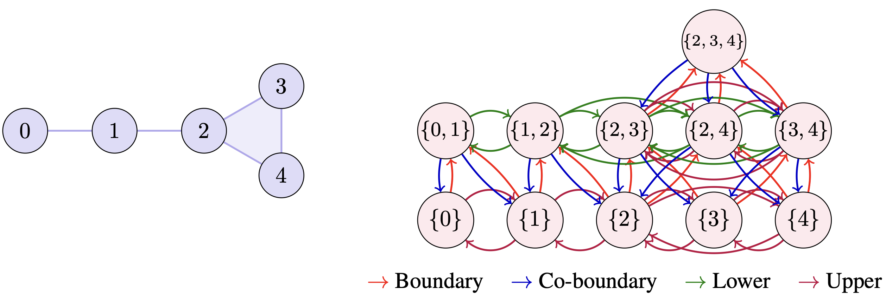

# Simplicial Oversquashing

This repository contains the code  for the paper [Demystifying Topological Message-Passing with Relational Structures: A Case Study on Oversquashing in Simplicial Message-Passing](https://openreview.net/forum?id=QC2qE1tcmd&noteId=z9opleOGK0) published at ICLR 2025.



## Installation

Create the conda environment:

```bash
conda create -n simplicial python=3.10 
```

Install the requirements:

```bash
conda activate simplicial
pip install -r requirements.txt
```

Perform graph lifting as a preprocessing step:

```bash
python pretransform_datasets.py
```

## Experiments

The experiments are organized based on where they appear in the paper. Each subsection contains the command to run the experiments. Make sure to preprocess the datasets before running the experiments as in the installation instructions. Note that these datasets are stored in `/tmp`. For experiments with `--max_concurrent`, you can set the maximum number of concurrent trials by changing the default value.

### TUDatasets (Section 5.1, Appendix E1)

These experiments are run with multiple arguments since some configurations are very time-consuming. The following commands are organized as

- `MUTAG, ENZYMES, NCI1` with `none, clique, ring` lifts and `non, fosr, afr4, sdrf` rewirings
- `PROTEINS` with `none, clique` lifts and `none, fosr, afr4, sdrf` rewirings
- `PROTEINS` with `ring` lift and `none, fosr, sdrf` rewirings
- `IMDB-BINARY` with `none` lift and `none, fosr, afr4, sdrf` rewirings
- `IMDB-BINARY` with `clique, ring` lifts and `none, fosr` rewirings

```bash
python main_experiment.py --datasets MUTAG ENZYMES NCI1 --lifts none clique ring --rewiring none fosr afr4 sdrf --models gcn gin rgcn rgin sgc sin cin cin++ --max_concurrent 70
python main_experiment.py --datasets PROTEINS --lifts none clique --rewiring none fosr afr4 sdrf --models gcn gin rgcn rgin sgc sin cin cin++ --max_concurrent 70
python main_experiment.py --datasets PROTEINS --lifts ring --rewiring none fosr sdrf --models gcn gin rgcn rgin sgc sin cin cin++ --max_concurrent 70
python main_experiment.py --datasets IMDB-BINARY  --lifts none --rewiring none fosr afr4 sdrf --models gcn gin rgcn rgin sgc sin cin cin++ --max_concurrent 70
python main_experiment.py --datasets IMDB-BINARY  --lifts clique ring --rewiring none fosr --models gcn gin rgcn rgin sgc sin cin cin++ --max_concurrent 70
```

### RingTransfer (Section 5.2)

```bash
python transfer.py --dataset ringtransfer --model rgcn --exp size --lifts none clique ring --max_concurrent 70
python transfer.py --dataset ringtransfer --model rgcn --exp rewire --lifts none clique ring --max_concurrent 70
python transfer.py --dataset ringtransfer --model rgcn --exp hidden_dim --lifts none clique ring --max_concurrent 70
```

### Graph Lifting Example and Curvature (Appendix D1)

```bash
python graph_lift.py --curvature or --graph long_dumbbell
```

### Graph Lifting Weighted Curvature (Appendix D2) and Edge Curvature Distribution (Appendix D3)

```bash
python weighted_curvature.py --dataset MUTAG --curvature or
```

### NeighborsMatch + Topology (Appendix D4)

```bash
python transfer.py --dataset nmatch --model rgcn --exp rewire --lifts none clique ring --max_concurrent 70
python topology.py --model cin++ --lifts none clique ring --max_concurrent 70
```

### Zinc (Appendix D5)

```bash
python main_experiment.py --datasets ZINC --lifts none clique ring --rewiring none fosr --models gin rgin sin cin++ --max_concurrent 70
```

### Node Classification WebKB and Planetoid (Appendix D6)

These experiments are run with multiple arguments since some configurations are very time-consuming. The following commands are organized as

- `CORNELL TEXAS` with `none, clique, ring` lifts and `none, fosr, prune` rewirings
- `WISCONSIN` with `none, clique` lifts and `none, fosr, prune` rewirings
- `WISCONSIN` with `ring` lift and `none, fosr, prune1d` rewirings
- `CORA CITESEER` with `none, clique` lifts and `none, fosr, prune1d` rewirings

```bash
python node_classification.py --datasets CORNELL TEXAS --lifts none clique ring --rewiring none fosr prune --max_concurrent 70
python node_classification.py --datasets WISCONSIN --lifts none clique --rewiring none fosr prune --max_concurrent 70
python node_classification.py --datasets WISCONSIN --lifts ring --rewiring none fosr prune1d --max_concurrent 70
python node_classification.py --datasets CORA CITESEER --lifts none clique --rewiring none fosr prune1d --max_concurrent 70
```

### Ablation (Appendix D7)

```bash
python ablation.py --datasets MUTAG --lifts none clique ring --ablation hidden --max_concurrent 70
python ablation.py --datasets MUTAG --lifts none clique ring --ablation layers --max_concurrent 70
```

### Pruning (Appendix D8)

```bash
python main_experiment.py --datasets MUTAG --lifts none clique ring --rewiring prune --models gin rgin sin cin++ --max_concurrent 70
```

## Citation

If you use this code in your research, please cite our paper:

```bibtex
@inproceedings{
taha2025demystifying,
title={Demystifying Topological Message-Passing with Relational Structures: A Case Study on Oversquashing in Simplicial Message-Passing},
author={Diaaeldin Taha and James Chapman and Marzieh Eidi and Karel Devriendt and Guido Montufar},
booktitle={The Thirteenth International Conference on Learning Representations},
year={2025},
url={https://openreview.net/forum?id=QC2qE1tcmd}
}
```
